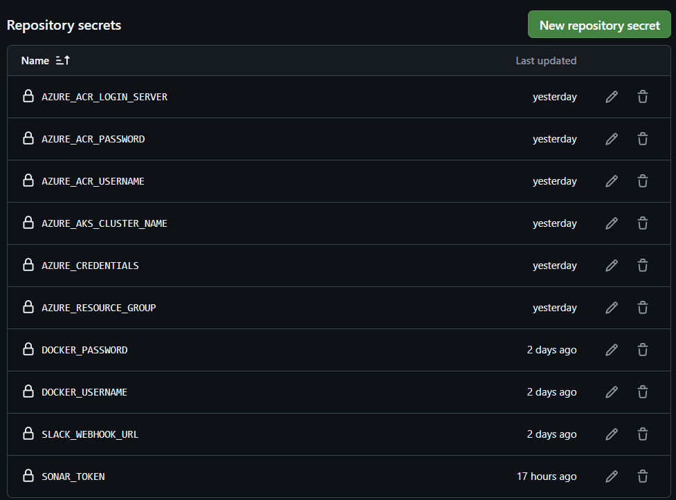
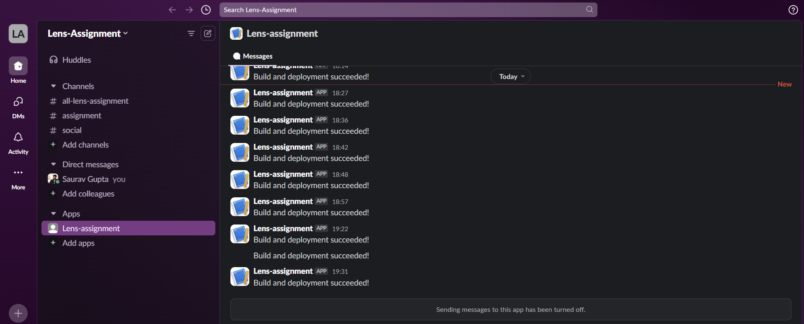
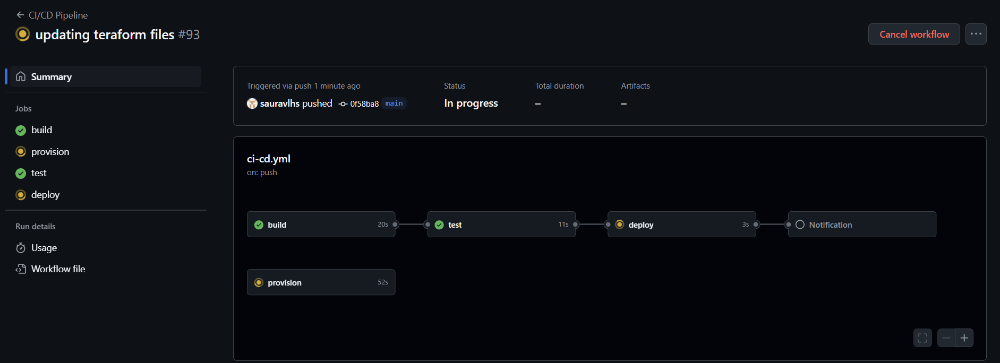

# LENS-Assignment

### Prerequisites
 Before starting, ensure the following tools, services, and configurations are ready:

- Azure Account: To use Azure services such as AKS and ACR.
- Azure Service Principal: For secure access to Azure resources.
- Azure CLI: Installed locally or you can use from azure portal as well for managing Azure resources.
- Docker Hub Account: for storing Docker images.
- GitHub Repository: Where your code is stored and configured with GitHub Actions.
- Slack: Create a slack account to receive builds notification

### Store credentials in the Repository Secrets

- Go to repository setting
- Under secrets and variables, select Actions
- Scroll down and click on new repository secret
- Add all the required username and password

After saving, it should look like before



**Now we have to create package.json file to install all the dependencies**

### Setting up Azure service principal
 In order to access the Azure portal resporces, we would be needing Azure service principal

 - Open Azure cloud shell
 - Run the below command to create Service Principal and generate credentials:
 ```bash
    az ad sp create-for-rbac --name "github-actions-sp" --role contributor --scopes /subscriptions/{subscription-id} --sdk-auth
```
Here, we have to replace the {subscription-id} with our subscription-id


### Setting up slack to receive notification
- After creating an account, select from scratch to build new app
- Select slack workspace where you want to post the message.
- In the app's settings, go to Incoming Webhooks on the left menu and select Activate Incoming Webhooks.
- Click Add New Webhook to Workspace, then choose a channel to post your messages and allow permissions. 
- After this we’ll get a webhook URL that we’ll use in our GitHub Actions workflow.
- Then save the webhook to github repository secrets as above.

### Now we will setup pipeline

1. **Build Step**
- We will Ubuntu OS for the job and NodeJS for the environment.
- We will define the required dependencies in package.json.

2. **Test Step**
- We will Ubuntu OS for the job and NodeJS for the environment.
- We will be using jest for testing scenario.

3. **Provision the infrastructure using Terraform**
- We'll use OS and environment same as above
- Required infrastructure will be defined in main.tf and it's variables in variables.tf
- The terraform folder will be stored in root directory
- In order to create the infrastructure using pipeline we will use auto approve after the terraform file is validated like below
```bash
     - name: Terraform Apply                                   
       run: terraform apply -auto-approve
```
4. **Build and push image to docker**
- First we will make sure thaat the build and test stage has passed successfully by adding the below line in the pipeline.
```bash
    needs: [build, test]
```
- Once this is successful, we will login to Docker. For secure login, we will use Repository secrets where docker login and password will be stored. we can access those via below command
```bash
    ${{ secrets.DOCKER_USERNAME }}
    ${{ secrets.DOCKER_USERNAME }}
```
DOCKER_USERNAME and DOCKER_USERNAME should be same as of what mentioned in Repository secrets
- Now we will have to push the docker image from local repository to remote repository
```bash
    docker push ${{ secrets.DOCKER_USERNAME }}/lensassignment:latest
```
This will push the Docker image from local to Docker Hub central repository.

**Now we have to access the azure portal**

5. **Azure Login**
- To Login to azure, we will azure credentials like below
```bash
    creds: ${{ secrets.AZURE_CREDENTIALS }}
```
- We can get this by running the below command
```bash
    az ad sp create-for-rbac --name "github-actions-sp" --role contributor --scopes /subscriptions/{subscription-id} --sdk-auth
```
It will give the output like below
```bash
{
  "clientId": "Your clientId",
  "clientSecret": "Your clientSecret",
  "subscriptionId": "Your subscriptionId",
  "tenantId": "Your tenantId",
  "activeDirectoryEndpointUrl": "https://login.microsoftonline.com",
  "resourceManagerEndpointUrl": "https://management.azure.com/",
  "activeDirectoryGraphResourceId": "https://graph.windows.net/",
  "sqlManagementEndpointUrl": "https://management.core.windows.net:8443/",
  "galleryEndpointUrl": "https://gallery.azure.com/",
  "managementEndpointUrl": "https://management.core.windows.net/"
}
```
Once logged in, we will deloy the application to AKS

6. **Application deployment to AKS**
- We will use Kubernetes to deploy the application.
- For this, we would need deployment.yml and service.yml file stored in the k8s folder in root directory
- In order to manage the external traffic, we would need ingress and we will configure it in ingress.yml stored in k8s folder.


**Once done you will see messages like below**



Once these are setup, we will configure Docker-compose, Kubernetes and Terraform 

Once all the pipeline, required dependencies are setup we can start the pipeline

Pipeline will start once there is a new commit to the "main" branch and will follow as below

